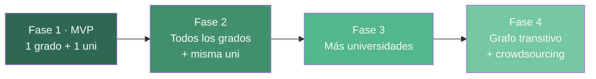
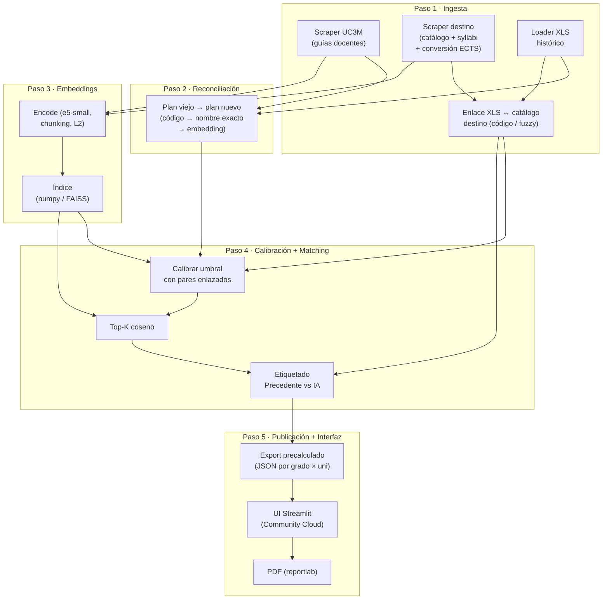
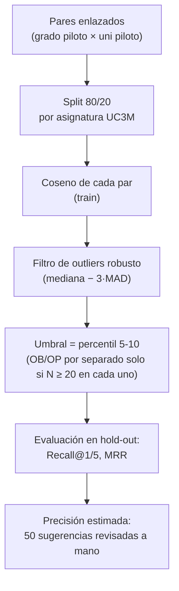

# Buscador de Convalidaciones AISC — Referencia técnica

> Documento de consulta: fuentes de datos, diseño del pipeline y decisiones técnicas. El calendario, las tareas y la forma de trabajar del equipo están en `plan_trabajo.md`.

## 1. Resumen

Buscador de equivalencias de asignaturas para la movilidad no europea (MNE) de la UC3M. Combina el scraping de catálogos académicos, el matching semántico con embeddings multilingües y un umbral de similitud calibrado con el histórico oficial de convalidaciones de la UC3M. Presupuesto: **0 €** (software libre, planes gratuitos y portátiles del equipo; detalle en la Sección 8).

### Flujo del usuario

1. El alumno ya sabe cuál es su universidad de destino.
2. Selecciona su grado UC3M y esa universidad.
3. Ve qué asignaturas de su grado puede convalidar allí, con score y etiqueta (`PRECEDENTE_APROBADO` / `SUGERENCIA_IA`).
4. Exporta una propuesta en PDF para enviársela al tutor, que es quien decide.

## 2. Fases del proyecto



| Fase | Alcance | Esfuerzo estimado |
|---|---|---|
| **1 · MVP** | 1 grado UC3M + 1 universidad destino | ~8 semanas a tiempo parcial (`plan_trabajo.md`) |
| **2** | Todos los grados UC3M + misma universidad | +3-4 semanas |
| **3** | Nuevas universidades, una a una | ~1-2 semanas por universidad (más si el catálogo es SPA o PDF) |
| **4** | Grafo de convalidaciones, inferencia transitiva y crowdsourcing de contratos | Tiene sentido a partir de ≥ 2 universidades |

La línea paralela de Erasmus queda descartada para no dispersar al equipo mientras se construye MNE.

---

## 3. Fuentes de datos

### 3.1. UC3M (backbone)
- Guías docentes en `aplicaciones.uc3m.es/cpa`: HTML estático, versiones ES y EN, con histórico por curso académico desde 2006.
- Formato único para todas las asignaturas; se refresca en cada curso académico.

### 3.2. Históricos oficiales MNE
- Página oficial: https://www.uc3m.es/secretaria-virtual/convocatoria-movilidad-no-europea
- EPS: https://www.uc3m.es/secretaria-virtual/media/secretaria-virtual/doc/archivo/doc_mne_listado-de-asignaturas-reconocidas-en-mne-eps/asignaturas_eps.xls
- CCSSJJ: https://www.uc3m.es/secretaria-virtual/media/secretaria-virtual/doc/archivo/doc_mne_listado-de-asignaturas-reconocidas-en-mne-ccssjj/asignaturas_ccssjj.xls
- Humanidades: https://www.uc3m.es/secretaria-virtual/media/secretaria-virtual/doc/archivo/doc_mne_listado-de-asignaturas-reconocidas-en-mne-fachcd/asignaturas_hcd.xls
- Cursos 2023-24 a 2025-26, **~14.700 filas brutas** (con duplicados entre cursos). Solo 2025-26 tiene 5.198 equivalencias de 25 países, 111 universidades y 41 titulaciones; 2.494 son de la EPS.
- Campos: país, universidad, titulación, código y nombre UC3M, ECTS, curso, tipo, y código y nombre de la asignatura destino.
- La UC3M avisa de que son **orientativas y no vinculantes**.
- Los `.xls` son formato Excel 97: `pandas.read_excel` necesita `xlrd`.

El XLS **no trae temarios del destino**, solo nombres y códigos. Para comparar por contenido hay que scrapear el catálogo del destino y **enlazar** cada fila del XLS con una asignatura de ese catálogo (Paso 1). Solo los pares enlazados sirven para calibrar con embeddings de contenido.

### 3.3. Universidades de destino
- Un conector por universidad (YAML de configuración) y normalización a un esquema común: asignatura, créditos, **créditos convertidos a ECTS**, contenidos, idioma y semestre.

### 3.4. Plataformas existentes (competencia, no fuentes)
- **Erappmus** (https://erappmus.com/): prepara el Learning Agreement para 425 destinos (Erasmus, fuera de Europa y SICUE) y cobra 20, 30 o 50 € por propuesta. No expone su banco de equivalencias ni tiene API: competidor de producto.
- **Uvora** (https://www.uvorasoftware.com/): matching semántico B2B de guías docentes, con API solo en el plan grande. Competidor técnico.
- El MVP no depende de ninguna plataforma externa.

---

## 4. Pipeline end-to-end

Cada paso es un **script independiente** que se puede ejecutar y testear por separado.



**Offline vs. producción**: los Pasos 1-4 y el export (E1) se ejecutan **offline** en un portátil o en GitHub Actions. Producción (E2-E3) solo lee JSON: no carga el modelo, no necesita `torch` y cabe en un plan gratuito. El nodo **A4** (enlace XLS ↔ catálogo destino) es del que dependen tanto la calibración como la etiqueta `PRECEDENTE_APROBADO`.

### Almacenamiento

| Componente | Dónde vive | Tamaño estimado |
|---|---|---|
| SQLite (asignaturas + histórico) | Local / artefacto de Actions | < 50 MB |
| Embeddings (10K × 384 × float32) | Local / artefacto de Actions | ~15 MB |
| Caché HTML de scraping | Solo local (no se sube al repo) | ~200 MB |
| Modelo `multilingual-e5-small` | Caché local / caché de Actions | ~470 MB |
| + Chromium de Playwright (solo si el destino es SPA) | Local / Actions | +~300 MB |
| **JSON publicados (lo único en producción)** | Repo / GitHub Pages | **< 10 MB** en el MVP |

Las dependencias Python (`torch` CPU ronda 1 GB instalado) solo van en las máquinas que ejecutan el pipeline, no en producción.

---

## 5. Detalle técnico por paso

### Paso 1 · Ingesta

#### Scraper UC3M (estructura verificada)

Comprobado sobre fichas reales (Álgebra Lineal 15363 y un curso de Humanidades 11692 del plan 456, Ficheros y bases de datos 13881 del plan 489, Fundamentos de producción de software 17631 del plan 486, y Constitución y sistema de fuentes 13565 de Derecho, plan 557), en ES y EN y en años distintos.

**Enumeración (sin scrapear las webs de grado)**: la aplicación pública de programas (`aplicaciones.uc3m.es/cpa/`) tiene tres endpoints JSON (POST), que son los que usa su propio formulario:

| Endpoint | Parámetros | Devuelve |
|---|---|---|
| `/cpa/findAnos.ajax` | — | Cursos disponibles (2006 → 2026) |
| `/cpa/findPlanes.ajax` | — | ~386 planes (318 activos), con `codigo` (plan) y `estudio.codigo` (est) |
| `/cpa/findAsignaturas.ajax` | `codPlan`, `ano` | Código y nombre de cada asignatura del plan (p. ej. 135 en el plan 456). **Sin** tipo, créditos ni curso: esos datos salen de la ficha |

**Ficha**: `GET /cpa/generaFicha?est={est}&plan={plan}&asig={asig}&anio={año}&idioma={1=ES|2=EN}`. Es HTML estático renderizado en servidor (~14-20 KB), **en UTF-8** (algunos acentos vienen como entidades HTML, p. ej. `&Aacute;`): basta con `requests` + `BeautifulSoup4`, sin Playwright. Hay que pedirla con un `plan`/`est` que contenga la asignatura ese curso (los que devuelve `findAsignaturas`): con otro plan, la web devuelve una página vacía de ~2,8 KB sin código, que el parser rechaza y la carga cuenta como `sin_ficha`.

| Dato | Dónde está en el HTML |
|---|---|
| Nombre y código | 1.º y 2.º `div.asignatura` ("Álgebra Lineal", "(15363)") |
| Curso académico | `div.anio` |
| Titulación, plan y estudio | Línea centrada "… (Plan: 456 - Estudio: 371)" |
| Coordinador, departamento, tipo, créditos, curso, cuatrimestre, rama | Patrón `<strong>Etiqueta: </strong>valor`. La rama solo aparece en FB |
| Fecha de última actualización | `<strong>Última actualización: </strong>` / `Checking date:` |
| Secciones | `div.panel.apartado`: el título va en `div.panel-heading` y el texto en `div.tarea` (texto con saltos de línea), `<textarea>` (con entidades HTML) o `<ul><li>` |

**Secciones**: sus títulos cambian con el idioma y **no todas existen en todas las fichas**:

| ES | EN | Presencia observada | ¿Se embebe? |
|---|---|---|---|
| Requisitos (Asignaturas o materias cuyo conocimiento se presupone) | Requirements | Opcional | No (se guarda) |
| Objetivos | Objectives | **Opcional** (falta en 2 de 5) | **Sí** |
| Resultados del proceso de formación y aprendizaje | Learning Outcomes | Opcional | No: suelen ser códigos genéricos del plan (p. ej. `S3FB10`) |
| Descripción de contenidos: Programa | Description of contents: programme | **Siempre** | **Sí (campo principal)** |
| Actividades formativas… / Sistema de evaluación | Learning activities… / Assessment System | Siempre | No (ruido) |
| Bibliografía básica / complementaria | Basic / Additional Bibliography | Casi siempre | No se embebe; se guarda como señal secundaria (Paso 4) |

**Decisiones**:
- Las secciones se identifican por un **diccionario de títulos ES/EN**, no por su posición. Si falta una sección, el campo queda vacío y no rompe el parser.
- Tipo normalizado: `Formación Básica`→FB, `Obligatoria`→OB, `Optativa`→OP, `Cursos de Humanidades`→HUM. Los cursos HUM (3 ECTS) aparecen en el listado de **todos** los planes: se scrapean una vez y quedan fuera del matching del MVP salvo que el XLS tenga pares con ellos.
- Se scrapea **EN (`idioma=2`) y ES**, y se embebe la versión EN cuando exista. Si la EN viene vacía, se usa la ES.
- El código `asig` se **comparte entre planes** (p. ej. 13881 aparece en varios dobles grados): se deduplica por `asig`.
- **Parámetro `anio`**: da la ficha de cualquier curso desde 2006. Permite obtener el temario de la asignatura UC3M **del año en que se aprobó cada fila del XLS** (Pasos 2 y 4).
- **Volumen y cortesía**: `robots.txt` no restringe `/cpa/`. Para el grado piloto son ~135 asignaturas × 2 idiomas ≈ 270 peticiones, unos 7 minutos a 1,5 s por petición y ~5 MB de caché. Todos los grados, deduplicando por `asig`, suman unos pocos miles de peticiones: una ejecución nocturna en GitHub Actions.
- **Detección de cambios**: primero se compara la fecha de "Última actualización"; si ha cambiado, se calcula el hash SHA-256 del texto extraído (no del HTML en bruto).
- **Longitud real**: Objetivos (~850 caracteres) + Programa (~1.400-1.700) ≈ 600-700 tokens, **por encima de 512**: hace falta trocear (Paso 3).

#### Scraper destino
- `requests` + `BS4` si el HTML es estático; `Playwright` si es SPA. Clase `BaseScraper` + un YAML por universidad:

```yaml
# config/scrapers/<uni>.yaml (ejemplo ilustrativo)
university_code: GATECH
university_name: Georgia Institute of Technology
country: USA
catalog_url: https://catalog.gatech.edu/courses/cs/
render: static            # static | playwright
selectors:
  course_list: "div.course-listing"
  course_name: "h3.course-title"
  course_code: "span.course-code"
  description: "div.course-desc"
  syllabus_link: "a.syllabus-link"
  credits: "span.credits"
credits_to_ects: 2.0      # factor de conversión documentado por la uni o la ORI
code_normalization: "remove_spaces_upper"
rate_limit_seconds: 2
```

**Asimetría de textos**: muchos catálogos de destino solo publican una descripción de 3-5 líneas, mientras que la guía UC3M trae el temario completo. Si se comparan textos tan desiguales, el coseno baja de forma sistemática. Por eso se embebe el **mismo tipo de campo en ambos lados** (descripción/objetivos frente a descripción) y el temario completo solo entra cuando el destino también lo publica (Paso 3).

#### Loader XLS histórico
- `pandas` + `xlrd`, validación con Pydantic, normalización (tildes, mayúsculas, espacios, códigos) y deduplicación entre cursos.
- Conserva las relaciones **n:m** (una asignatura UC3M convalidada por dos del destino, o al revés) con un `group_id`.
- Salida: tabla `historical_matches`.

#### Enlace XLS ↔ catálogo destino
1. Coincidencia por **código normalizado** (`CS 1332` = `CS1332`).
2. Si falla, **fuzzy match** del nombre con `rapidfuzz` (≥ 90) limitado a la misma universidad.
3. Lo que no enlace se marca `unlinked`: cuenta en el EDA pero no calibra ni etiqueta.

Salida: `historical_matches.dest_subject_id`. La **tasa de enlace** es un criterio más para elegir la universidad piloto.

---

### Paso 2 · Reconciliación plan viejo → plan nuevo

Se hace en cascada, de más barato y fiable a menos:

```
1. Mismo código en el plan vigente            → match directo
   (findAsignaturas.ajax con el año actual)
2. Nombre normalizado idéntico                → match directo
3. Embedding del CONTENIDO: ficha del código viejo en el año del XLS
   (generaFicha?anio=2023…) vs fichas del plan vigente:
     sim ≥ τ_alto  → match automático
     τ_bajo ≤ sim < τ_alto → revisión manual
     sim < τ_bajo  → asignatura eliminada / sin equivalente
4. Desdoblamientos y fusiones (1→2, 2→1) → siempre revisión manual
```

- **τ_alto / τ_bajo** (0.85 / 0.65 como punto de partida) se ajustan con la revisión manual del Bloque B, no se dejan fijos.
- Como la aplicación `cpa` guarda las fichas de años anteriores, el nivel 3 compara **temarios** en lugar de solo nombres. Si la ficha antigua no existe, se compara solo por nombre.
- Salida: tabla `old_code → new_code` con el campo `method` (code / exact / embedding / manual).

Es un paso crítico: sin él, los registros históricos de asignaturas que han cambiado de código no se pueden usar ni para calibrar ni para etiquetar precedentes.

---

### Paso 3 · Embeddings

| Decisión | Elección | Por qué |
|---|---|---|
| **Modelo base** | `intfloat/multilingual-e5-small` | Multilingüe, 384 dims, **512 tokens** y rápido en CPU |
| **Alternativas del benchmark** | `paraphrase-multilingual-MiniLM-L12-v2` (128 tokens), `multilingual-e5-base` (768 dims) | Se elige con datos (Recall@5 en el hold-out), no a priori |
| **Input UC3M** | `"query: {nombre}. {Objetivos}. {Programa}"` (EN si existe). Sin Resultados/competencias, actividades, evaluación ni bibliografía | Los modelos e5 necesitan el prefijo `query:` en tareas simétricas; las competencias son códigos genéricos del plan que harían parecidas asignaturas distintas |
| **Textos largos** | Chunks de ~400 tokens → media de los embeddings → normalización | Evita truncar el temario |
| **Normalización** | L2 antes de indexar (`normalize_embeddings=True`) | Así el producto escalar es coseno real |
| **Índice** | Producto matricial `numpy` en el MVP; FAISS `IndexFlatIP` desde la Fase 3 | Con cientos de asignaturas FAISS no aporta nada; con miles sí |
| **Tiempo** | Pocos minutos para ~1.000 asignaturas en CPU | No hace falta GPU |

Un modelo con ventana de 128 tokens solo leería el nombre y el principio del temario (~una quinta parte del texto). El benchmark debe confirmar que `e5-small` con chunking mejora Recall@5; si no, se vuelve a MiniLM con chunking.

---

### Paso 4 · Calibración, evaluación y matching

#### Datos de calibración
Pares `(asignatura UC3M del grado piloto, asignatura destino)` del XLS que estén **reconciliados** (Paso 2) y **enlazados** con el catálogo scrapeado (Paso 1). Solo en esos pares se conoce el contenido de los dos lados.

No se puede calibrar con todo el histórico: las asignaturas destino de las otras ~110 universidades no tienen temario scrapeado, y calibrar con embeddings *solo de nombre* da una distribución que no se puede comparar con la del matching por contenido. En el MVP el umbral es **del grado piloto con la universidad piloto**. En la Fase 2 será por grado con esa misma universidad, y solo tendrá umbral propio el grado con ≥ 20 pares enlazados; el resto usará el umbral global de esa universidad.

#### Procedimiento



- **Split por asignatura UC3M**, no por fila, para que la misma asignatura no aparezca en train y test (fuga de información). Se deduplican los cursos antes de partir.
- **Outliers**: mediana − 3·MAD aguanta mejor que la media ± N·σ con muestras pequeñas. Los pares descartados se listan en el notebook para revisarlos a mano: pueden ser errores del XLS o convalidaciones legítimas con descripciones pobres.
- **Por qué no "precision" sobre el hold-out**: el histórico solo contiene positivos, y que un par no esté en el XLS **no significa que sea negativo** (simplemente nadie lo pidió). La precisión se estima revisando a mano una muestra de sugerencias por encima del umbral; el tutor la valida si es posible.

**Objetivos de calidad (hito del Bloque C)**, iniciales y revisables tras el EDA:
- Recall@5 ≥ 0.80 en el hold-out: la asignatura destino aprobada aparece en el top-5 de su asignatura UC3M.
- Precisión estimada ≥ 0.70 en la muestra manual de `SUGERENCIA_IA` por encima del umbral.
- Se informa del tamaño de muestra. Si hay < 30 pares enlazados en el hold-out, las métricas se presentan como orientativas.

#### Matching
Para cada asignatura UC3M del grado:
1. Top-10 asignaturas destino por coseno.
2. Se filtran por el umbral calibrado.
3. Etiquetado:
   - **`PRECEDENTE_APROBADO`**: el par está en el XLS (reconciliado y enlazado). **Se muestra siempre**, aunque quede por debajo del umbral, porque ya fue aprobado.
   - **`SUGERENCIA_IA`**: par nuevo por encima del umbral.
4. Cada resultado muestra ECTS UC3M frente a ECTS convertidos del destino, y un aviso si la diferencia supera el 25 %.
5. **Señal secundaria (opcional, se valida en el benchmark)**: si la bibliografía básica UC3M y el syllabus del destino citan el **mismo libro de texto** (coincidencia aproximada de título y autor con `rapidfuzz`), se muestra como indicio ("mismo libro de referencia"). Solo pasa a modificar el score si mejora Recall@5 en el hold-out.

El MVP propone pares 1:1. Las convalidaciones n:m del histórico se muestran agrupadas como precedente, pero la IA no propone combinaciones del tipo "2 asignaturas destino → 1 UC3M" (línea futura).

---

### Paso 5 · Publicación + Interfaz

Como el espacio de consultas es finito (grado × universidad), **no hace falta calcular nada cuando el alumno busca**: el pipeline genera un JSON por combinación y la interfaz solo lo lee.

| Componente | Tecnología | Coste |
|---|---|---|
| Export | `src/export/build_static.py` → `public/data/<grado>__<uni>.json` + `index.json` (lista de grados y universidades) | 0 € |
| Frontend MVP | Streamlit que lee los JSON; desplegado en **Streamlit Community Cloud** (gratis, desde un repo de GitHub) | 0 € |
| PDF | `reportlab` dentro de la app de Streamlit (en Windows no necesita dependencias nativas, a diferencia de `weasyprint`) | 0 € |
| Frontend Fase 3 | Web estática (HTML/JS) en **GitHub Pages** o en la web de AISC, leyendo los mismos JSON; PDF en el navegador (`window.print()` con CSS de impresión) | 0 € |

Esquema del JSON (contrato entre el pipeline y la interfaz, que se cierra en el Bloque A):

```json
{
  "grado": "...", "universidad": "...", "generado": "2026-10-20", "modelo": "multilingual-e5-small",
  "umbral": 0.71,
  "resultados": [
    {"uc3m": {"codigo": "...", "nombre": "...", "ects": 6},
     "destino": {"codigo": "...", "nombre": "...", "ects": 6.0, "url": "..."},
     "score": 0.87, "etiqueta": "PRECEDENTE_APROBADO", "aviso_ects": false}
  ]
}
```

**Por qué no hay API**: una API solo tiene sentido si hay cálculo en tiempo de consulta, y aquí no lo hay. Quitarla ahorra un servidor y trabajo en la parte web. Si en el futuro hace falta búsqueda libre ("pega el temario de tu asignatura"), entonces sí habría que servir el modelo. Esa funcionalidad queda fuera del alcance.

**Límites del hosting**: Streamlit Community Cloud tiene recursos limitados (unos 2,7 GB de RAM como máximo según Streamlit, sujetos a cambios) y duerme las apps inactivas. Con JSON precalculados sobra con creces, pero **no se debe cargar el modelo en la app**. Hugging Face Spaces no sirve como alternativa gratuita para apps con cómputo (solo los Spaces estáticos son gratis).

```
┌────────────────────────────────────────────────────────────┐
│  Grado: Ing. Informática  │  Destino: <uni piloto>          │
├────────────────────────────────────────────────────────────┤
│  UC3M                    Destino      ECTS    Score  Tag    │
│  ☑ Estructuras de Datos  CS 1332      6 / 6   0.87   ✅     │
│  ☑ Sistemas Operativos   CS 2200      6 / 8⚠  0.83   ✅     │
│  ☐ Redes                 CS 3251      6 / 6   0.79   🤖     │
│  ✅ Precedente aprobado   🤖 Sugerencia IA   ⚠ ECTS dispares  │
│  ECTS seleccionados: 12/30                  [Generar PDF]  │
└────────────────────────────────────────────────────────────┘
```

---

## 6. Estructura del repositorio

```
convalidaciones-aisc/
├── README.md
├── AGENTS.md                  # contexto del proyecto para los asistentes de IA
├── pyproject.toml
├── .gitignore                 # excluye data/raw (caché HTML) y data/processed
├── .github/workflows/
│   ├── ci.yml                 # lint + pytest
│   └── refresh.yml            # re-scraping + regeneración de JSON (Fase 2)
├── config/
│   ├── settings.yaml
│   └── scrapers/<uni>.yaml
├── docs/                      # candidatas.md, architecture.md, feedback.md, hojas de revisión
├── src/
│   ├── models/            # Pydantic: subject.py, historical.py, match.py
│   ├── scrapers/          # base.py, uc3m.py, destination.py
│   ├── loaders/           # historical_xls.py, link_catalog.py
│   ├── reconciliation/    # old_to_new.py
│   ├── embeddings/        # encoder.py (chunking + L2), index.py
│   ├── matching/          # calibration.py, evaluation.py, matcher.py
│   ├── export/            # build_static.py (JSON por grado × uni)
│   └── ui/                # app.py (Streamlit), pdf.py (reportlab)
├── public/data/           # JSON publicados (lo único que usa producción)
├── data/
│   ├── historical/  raw/  processed/
├── tests/
│   ├── fixtures/uc3m/     # fichas HTML guardadas
│   ├── test_scrapers/ test_loaders/ test_reconciliation/
│   ├── test_embeddings/ test_matching/ test_export/
│   └── test_e2e.py
└── notebooks/
    ├── 01_eda_historical.ipynb
    ├── 02_reconciliation.ipynb
    ├── 03_model_benchmark.ipynb
    └── 04_calibration.ipynb
```

El módulo `matching/graph.py` (NetworkX) se añade en la Fase 4.

---

## 7. Post-MVP

### Fase 2 · Todos los grados, misma universidad
| Tarea | Detalle |
|---|---|
| Scraper UC3M para todos los grados | Mismo scraper con más planes; deduplicar por `asig` |
| Reconciliación + enlace para todos los grados | Revisión manual de la franja dudosa |
| Recalibrar por grado (≥ 20 pares enlazados) o fallback global de la universidad | Mismo notebook, parametrizado |
| Selector multi-grado en la UI | Lee `index.json` |
| Workflow `refresh.yml` (GitHub Actions, `schedule`) | Re-scraping + regeneración de JSON; 0 € |

### Fase 3 · Más universidades
| Tarea | Detalle |
|---|---|
| YAML del nuevo destino + conversión ECTS | Selectores + URLs |
| Scraper + enlace + embeddings | Pipeline reutilizado |
| Calibración propia si hay ≥ 20 pares enlazados; si no, umbral global | — |
| Índice FAISS | Cuando el volumen lo justifique (solo offline) |
| Web estática en GitHub Pages o dentro de la web de AISC | Lee los mismos JSON; sin servidor |

### Fase 4 · Grafo, inferencia transitiva y crowdsourcing

**Grafo transitivo**
- `NetworkX` DiGraph. Aristas: precedentes aprobados (peso 1.0) y similitudes por encima del umbral.
- Score transitivo = producto de los scores del camino, **máximo 2 saltos**.
- Las inferencias se muestran siempre como **"sugeridas"**, con la **cadena de relaciones** que las origina. La decisión es del tutor.

**Crowdsourcing de contratos de estudios**
- Pedir a los estudiantes que aporten sus contratos de estudios (learning agreements), con acceso anticipado a nuevas universidades como incentivo. Aporta precedentes de universidades que todavía no están en el sistema y de cursos posteriores a los XLS oficiales.
- Formulario con la cuenta UC3M (Google Forms / Microsoft Forms), 0 €.
- Hay que **anonimizar** los datos personales antes de usarlos y registrar el **consentimiento** (RGPD). Los contratos se cargan como una fuente más de `historical_matches`, con un campo `source = crowdsourcing`, y pasan por el mismo enlace y reconciliación.
- Tiene sentido en esta fase porque su valor crece con el número de universidades y porque exige un flujo de consentimiento que no queremos abordar en el MVP.

---

## 8. Costes (presupuesto 0 €)

| Necesidad | Solución gratuita | Coste | Límites a vigilar |
|---|---|---|---|
| Software | Todo open source (Python, sentence-transformers, pandas, Streamlit, reportlab…) | 0 € | — |
| Modelo de embeddings | `multilingual-e5-small` descargado de Hugging Face Hub y ejecutado en CPU local | 0 € | Sin APIs de pago |
| Cómputo del pipeline | Portátiles del equipo (≥ 8 GB de RAM recomendados) | 0 € | El benchmark con `e5-base` es el paso más pesado; Google Colab o Kaggle (gratis) como plan B |
| Asistentes de IA para programar | GitHub Copilot Student (modo Auto) en OpenCode, modelos Free de OpenCode Zen, Google Antigravity (Claude Opus/Sonnet 4.6, Gemini 3.1 Pro) y Google AI Plus para estudiantes | 0 € | Créditos mensuales de Copilot y cuota semanal de Antigravity; detalle en la guía de IA gratis |
| Repo, CI y refresco periódico | GitHub (organización gratuita) + GitHub Actions | 0 € | Ilimitado en repos públicos; 2.000 min/mes en privados |
| Hosting MVP | Streamlit Community Cloud | 0 € | RAM limitada y apps que duermen si no se usan; no cargar el modelo en la app |
| Hosting Fase 3 | GitHub Pages o la web de AISC (estático) | 0 € | Sitios de hasta 1 GB y 100 GB/mes de tráfico (límites orientativos) |
| Dominio | Subdominio gratuito (`*.streamlit.app`, `*.github.io`) o la web de AISC | 0 € | Dominio propio opcional (~10 €/año) |
| Crowdsourcing (Fase 4) | Formulario con la cuenta UC3M | 0 € | RGPD: consentimiento + anonimización |
| **Total** | | **0 €** | |

Lo único que haría falta pagar es lo que queda fuera a propósito: una API con el modelo cargado para búsquedas libres, GPUs o APIs de LLM de pago.

---

## 9. Riesgos

| Riesgo | Impacto | Mitigación |
|---|---|---|
| Pocos pares enlazados en el piloto | Umbral poco fiable | Elegir el piloto por pares enlazables, no solo por pares brutos; métricas marcadas como orientativas si N < 30 |
| Catálogo destino sin descripciones o en PDF | Matching pobre | Criterio de elección en el Bloque A; parser PDF (`pdfplumber`) como plan B |
| Asimetría de longitud de textos | Coseno sesgado a la baja | Embeber campos comparables en los dos lados |
| Idiomas distintos | Similitud cruzada más baja | Modelo multilingüe + guía UC3M en EN |
| Conversión ECTS ↔ créditos locales | Propuestas con créditos incoherentes | Factor por universidad en el YAML + aviso en la UI |
| Histórico "orientativo" con errores | Umbral descolocado | Filtro MAD + revisión de los outliers |
| Cambios en la web de destino / bloqueo | Scraper roto | Caché, hashing, rate limit, `robots.txt` |
| Cambian los endpoints `cpa/*.ajax` o el HTML de la ficha (no están documentados) | Scraper UC3M roto | Tests con fichas guardadas como fixtures; plan B: enlaces del apartado "Programa" de las webs de grado de uc3m.es, o el PDF de la ficha (`generaFichaPDF`) |
| Equipo junior y a tiempo parcial | Tareas que se alargan o se quedan a medias | Tareas pequeñas con "hecho cuando"; las grandes en pareja; semana de buffer; revisión semanal |
| Código generado con IA que nadie entiende | Errores difíciles de arreglar; nadie aprende | PR revisada por otra persona; tests obligatorios; regla "no mergees lo que no entiendes" |
| Cambian o desaparecen los planes gratuitos | App caída | La producción son JSON estáticos: se pueden mover a cualquier hosting estático en minutos |
| Portátil del equipo con poca RAM | Pipeline lento o que no corre | Ejecutar en GitHub Actions o en Colab; `e5-small` necesita poca memoria |

---

## 10. Preguntas abiertas

- **¿Qué grado y universidad piloto?** Se decide con el EDA del Bloque A según el criterio "pares históricos × catálogo accesible".
- **Factor de conversión de créditos del destino**: confirmarlo con la Oficina de Relaciones Internacionales (ORI) de la UC3M o con la universidad destino.
- **¿Repo público o privado?** Público da Actions ilimitado y encaja con una asociación, pero **no se deben publicar los temarios scrapeados** (tienen derechos de sus autores): el repo y los JSON solo llevan nombres, códigos, créditos, scores y enlaces a la fuente. La caché HTML queda en local (`.gitignore`).
- **Hosting de la Fase 3**: preguntar a AISC qué hosting tiene su web y si admite páginas estáticas.
- **División del equipo**: en la Fase 1 se trabaja sin roles fijos; cuándo y cómo se divide en subequipos se decide al terminar el MVP.
